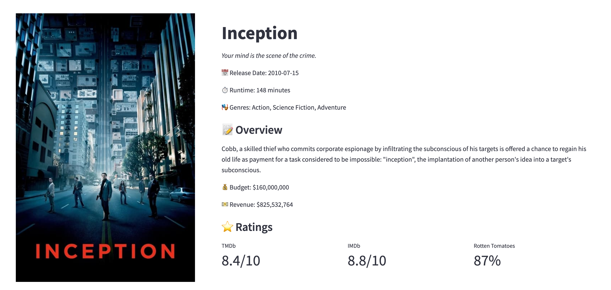
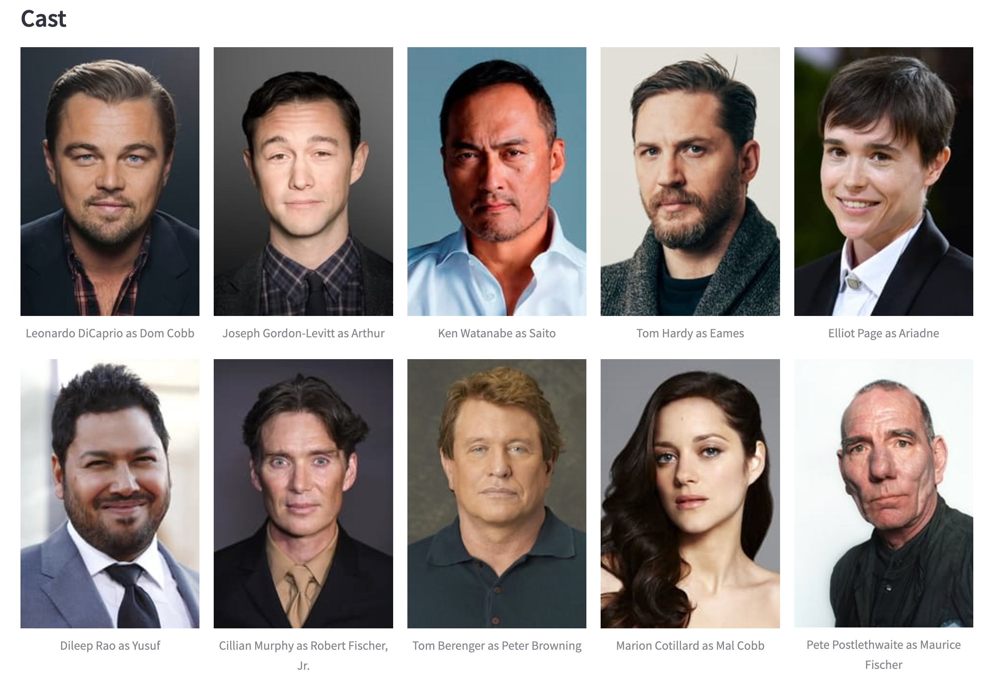
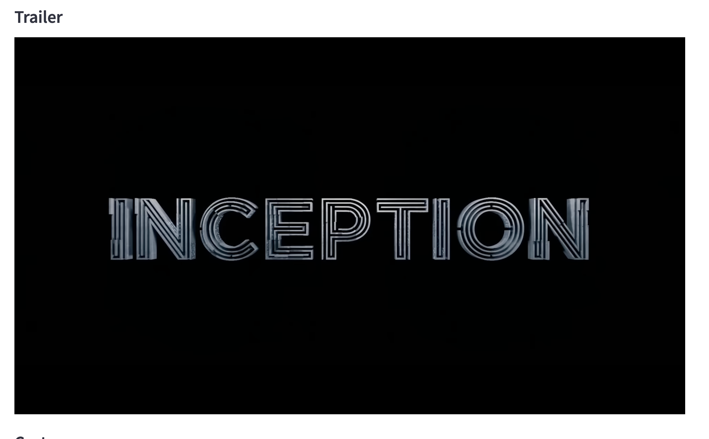
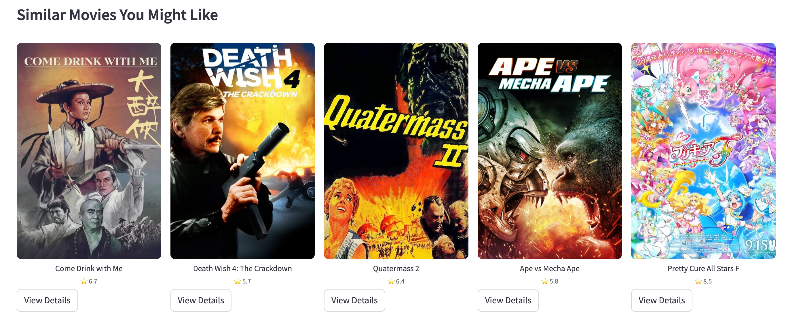

# Movie Recommender for Ammu

A comprehensive movie discovery platform built with Streamlit that helps users explore movies and TV shows. The application integrates with TMDb and OMDB APIs to provide detailed information about movies, including trailers, cast information, and streaming availability.

## The Story Behind

Ever found yourself endlessly scrolling through streaming platforms, unable to decide what to watch? That's exactly what inspired this project. Created as a solution to those countless evenings spent with my girlfriend trying to find the perfect movie, this app streamlines our movie selection process. No more endless scrolling or jumping between different platforms – now we have all the information we need in one place, making our movie nights much more enjoyable and less about the search, more about the watching!

### Why This App?
- **End the "What Should We Watch?" Debate**: Quick access to comprehensive movie information
- **Smart Recommendations**: Find similar movies to ones you've enjoyed
- **All-in-One Solution**: Trailers, ratings, and streaming info in one place
- **Time-Saving**: Spend less time searching, more time watching


## Features

### 1. Content Discovery
- Search for both Movies and TV Shows
- Browse by genres
- Responsive grid layout for search results
- Pagination support for seamless browsing
- Quick access to movie/show details


### 2. Detailed Content Information
- High-quality poster images
- Comprehensive movie/show details
- Genre tags
- Release date and runtime
- Plot overview
- Multiple rating sources (IMDb, Rotten Tomatoes)



### 3. Cast Information
- Grid layout of cast members
- Character names
- Profile pictures
- Quick access to cast details



### 4. Trailer Integration
- Official trailer embedding
- YouTube integration
- Prioritized trailer selection (Official trailers → Regular trailers → Teasers)
- Responsive video player



### 5. Similar Movies
- Horizontal scrollable view of similar movies
- Quick access to movie details
- Rating display
- One-click navigation



### 6. Streaming Information
- Available streaming platforms
- Region-based availability
- Direct links to streaming services


## Setup

1. Clone the repository:
   ```bash
   git clone [repository-url]
   cd movie-recommender
   ```

2. Create and activate a virtual environment:
   ```bash
   python -m venv venv
   source venv/bin/activate  # On Windows: venv\Scripts\activate
   ```

3. Install dependencies:
   ```bash
   pip install -r requirements.txt
   ```

4. Create a `.env` file with your API keys:
   ```env
   TMDB_API_KEY=your_tmdb_api_key_here
   OMDB_API_KEY=your_omdb_api_key_here
   ```

5. Run the app:
   ```bash
   streamlit run app.py
   ```

## Deployment

### Option 1: Streamlit Cloud (Recommended)

1. Push your code to a GitHub repository
2. Visit [Streamlit Cloud](https://streamlit.io/cloud)
3. Sign in with your GitHub account
4. Click "New app"
5. Select your repository, branch, and main file path (`app.py`)
6. Add your environment variables (API keys):
   ```
   TMDB_API_KEY=your_tmdb_api_key
   OMDB_API_KEY=your_omdb_api_key
   ```
7. Click "Deploy!"

Your app will be live at `https://your-app-name.streamlit.app`

### Option 2: Local Server

To run the app on your local network:

```bash
streamlit run app.py --server.address 0.0.0.0 --server.port 8501
```

Then access the app from other devices on your network using:
`http://your-computer-ip:8501`

### Option 3: Docker Deployment

1. Create a Dockerfile:
   ```dockerfile
   FROM python:3.13-slim
   
   WORKDIR /app
   
   COPY requirements.txt .
   RUN pip install -r requirements.txt
   
   COPY . .
   
   EXPOSE 8501
   
   CMD ["streamlit", "run", "app.py", "--server.address", "0.0.0.0"]
   ```

2. Build and run the Docker container:
   ```bash
   docker build -t movie-recommender .
   docker run -p 8501:8501 -e TMDB_API_KEY=your_key -e OMDB_API_KEY=your_key movie-recommender
   ```

### Important Security Notes

1. Never commit your API keys to the repository
2. Use environment variables for sensitive information
3. If using Docker, ensure your `.dockerignore` includes:
   ```
   .env
   .git
   __pycache__
   *.pyc
   ```

## Upcoming Improvements (v2)

### Performance Optimizations
- Image size optimization for faster loading
- API call caching
- Lazy loading for images and content

### Feature Enhancements
- Advanced filtering options
- User preferences and watchlist
- More detailed streaming information
- Enhanced mobile responsiveness

### Bug Fixes
- Uniform image sizing in similar movies section
- Improved error handling for API failures
- Better handling of missing content

*Stay tuned for these improvements in the next version!*

## Technologies Used

- **Frontend Framework**: Streamlit
- **APIs**: 
  - TMDb (The Movie Database) for movie data and trailers
  - OMDB (Open Movie Database) for additional ratings
- **Languages**: Python 3.13
- **Key Libraries**:
  - streamlit
  - requests
  - python-dotenv
  - pandas

## Getting API Keys

1. **TMDb API Key**:
   - Visit [The Movie Database (TMDb)](https://www.themoviedb.org/)
   - Create an account and go to your settings
   - Navigate to the API section
   - Register for an API key

2. **OMDB API Key**:
   - Visit [OMDb API](http://www.omdbapi.com/)
   - Click on the API key tab
   - Register for a free or paid API key

## Contributing

Feel free to fork this repository and submit pull requests. You can also open issues for bugs or feature requests.

## License

This project is licensed under the MIT License - see the LICENSE file for details.

## Acknowledgments

- TMDb for providing the movie database API
- OMDB for providing additional movie ratings
- Streamlit for the amazing web framework

---
*Note: Replace the screenshot placeholders with actual screenshots of your application. Create a `screenshots` directory and add your images there.*
